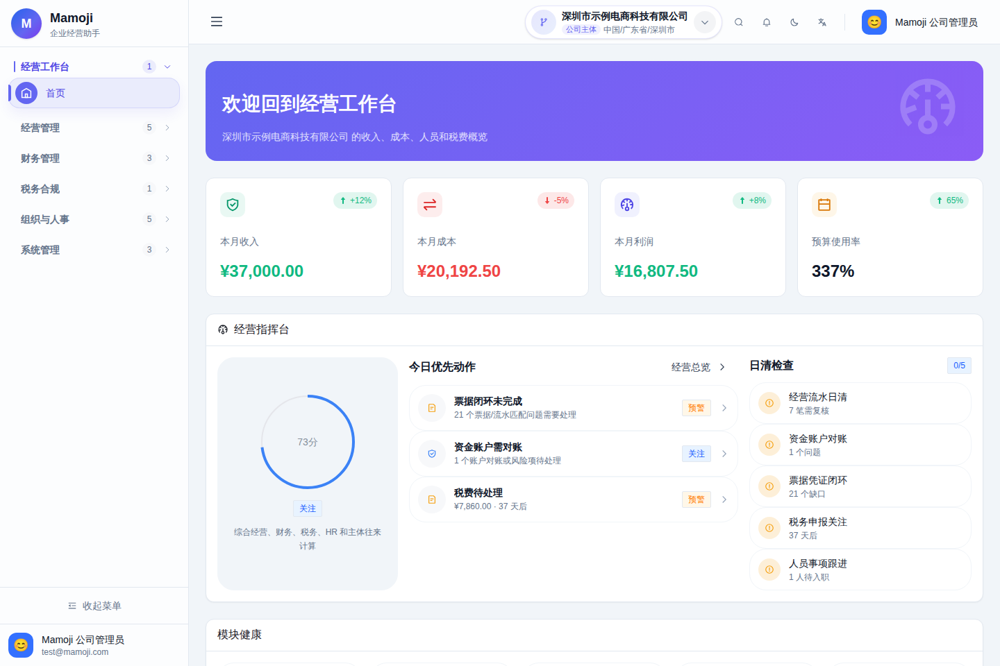
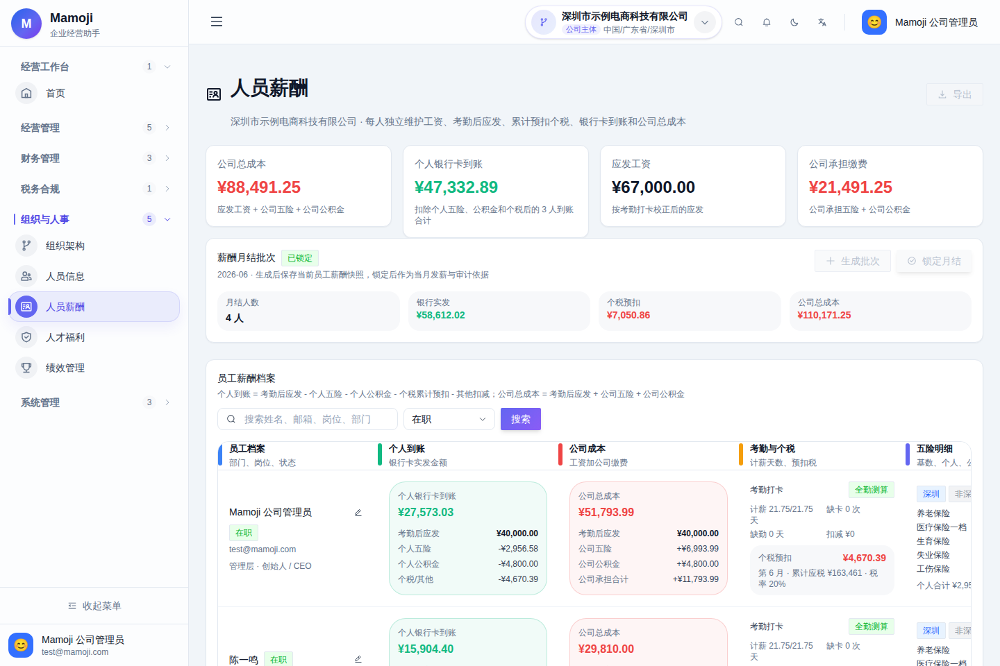
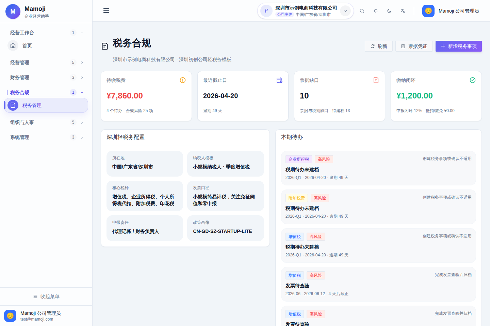
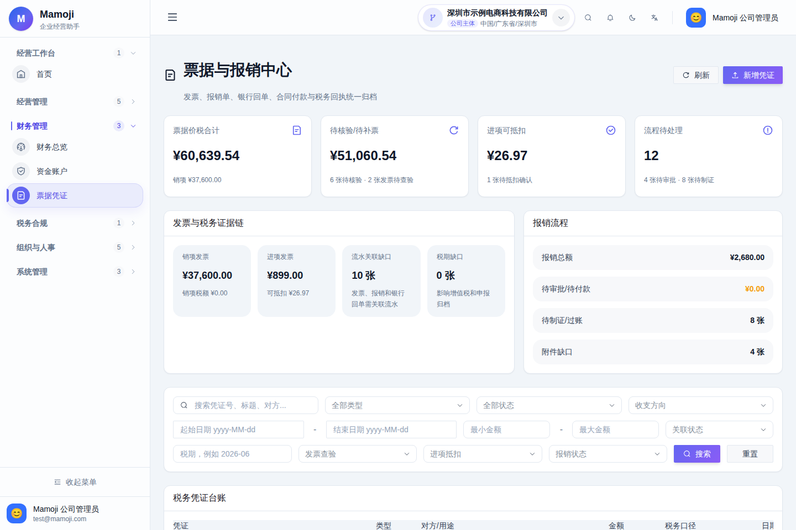
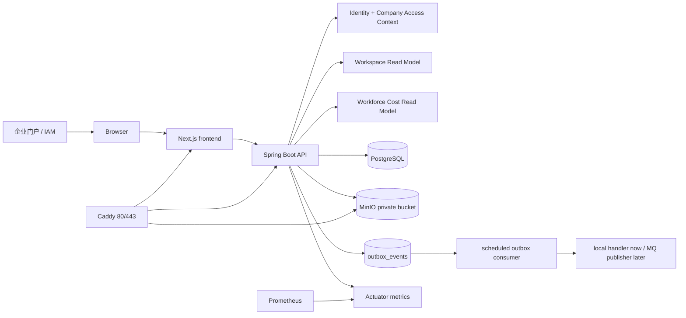

# Mamoji

Mamoji 是面向企业门户的内部经营协同模块。它把经营流水、预算、审批、资金账户、票据证据、组织人员和人力成本连接起来，帮助团队在一条可审计链路上完成日常经营控制。

默认产品模式是 `internal-module`。组织人员与人力成本属于公司经营的默认能力；绩效福利等人才扩展、税务工作台、政策中心、家庭主体和备份 UI 按需开启。

当前项目采用前后端分离架构：后端是 Spring Boot API，前端是 Next.js 应用，数据落在 PostgreSQL，附件走 MinIO，对外生产入口由 Caddy 承接，监控使用 Prometheus。

## 目录

- [适合场景](#适合场景)
- [功能地图](#功能地图)
- [模块模式](#模块模式)
- [系统截图](#系统截图)
- [系统架构](#系统架构)
- [技术栈](#技术栈)
- [5 分钟启动](#5-分钟启动)
- [演示账号](#演示账号)
- [本地开发](#本地开发)
- [生产部署](#生产部署)
- [安全与合规](#安全与合规)
- [异步事件与 RocketMQ 策略](#异步事件与-rocketmq-策略)
- [验证命令](#验证命令)
- [项目结构](#项目结构)
- [文档索引](#文档索引)
- [常见问题](#常见问题)

## 适合场景

Mamoji 当前更适合作为企业现有门户中的经营与资金证据模块：

| 场景 | Mamoji 提供的能力 |
| --- | --- |
| 初创公司经营台账 | 收入、成本、预算、现金流、经营趋势和风险提醒 |
| 内部审批协同 | 申请、处理、撤回、审批轨迹和业务对象状态联动 |
| 票据与附件归档 | 发票、报销、合同、税票、银行回单统一归档到 MinIO |
| 宿主系统集成 | 统一人员上下文、公司成员关系、角色权限和模块开关 |
| 可选扩展包 | 按需启用人才发展、税务、政策、家庭主体和备份 UI |

Mamoji 不替代电子税务局、银行、正式财务软件或人事合同系统。税费和薪酬结果应由财务负责人、代理记账或当地政策口径复核后使用。

## 功能地图

| 模块 | 页面或接口 | 核心能力 |
| --- | --- | --- |
| 工作台 | `/dashboard`、`/api/v1/workspace` | 一次聚合收入、成本、资金、预算、审批与证据风险 |
| 审批协同 | `/approvals` | 申请、待办、通过、驳回、撤回和轨迹 |
| 资金账户 | `/accounts` | 银行账户、现金、信用、余额、对账状态和风险标记 |
| 经营流水 | `/transactions` | 收入支出、退款链路、分类、预算关联 |
| 预算管理 | `/budgets` | 公司与成本分类预算、执行额、版本冲突和风险等级 |
| 经营报表 | `/reports` | 趋势、分类占比、年度视图和经营洞察 |
| 周期事项 | `/recurring` | 工资、房租、SaaS、税费申报等周期性事项 |
| 票据凭证 | `/receipts` | 上传、查验状态、抵扣状态、审批、会计过账、附件下载 |
| 组织人员 | `/hr/organization` | 部门、员工档案、入离职状态、岗位与部门预算 |
| 薪酬月结 | `/admin/compensation` | 五险一金、个税、个人到卡、公司总成本、月结锁定 |
| 人力成本 | `/hr/workforce-cost`、`/api/v1/workforce-cost` | 薪酬快照、部门成本、预算差异、六期趋势和经营支出占比 |
| 公司与权限 | `/settings`、`/admin/users`、`/api/v1/platform/access-context` | 当前人员、公司、角色、数据范围、权限和模块能力 |
| 可选：税务 | `/tax` | 税费台账、申报日历、资料清单、风险项 |
| 可选：人才扩展 | `/hr/benefits`、`/hr/performance` | 福利、绩效等非经营必需的人才管理能力 |
| 可选：备份 UI | `/backup` | 备份状态、结构化导出和受控恢复 |

默认侧栏只设置五个一级模块：`经营工作台`、`经营管理`、`财务管理`、`组织与人力成本`、`系统管理`。可选税务归入财务管理，人才扩展归入组织与人力成本，避免一级导航随能力开启持续膨胀。

## 模块模式

默认配置：

```env
MAMOJI_PRODUCT_MODE=internal-module
MAMOJI_MODULE_HOUSEHOLD_ENABLED=false
MAMOJI_MODULE_PEOPLE_CORE_ENABLED=true
MAMOJI_MODULE_WORKFORCE_COST_ENABLED=true
MAMOJI_MODULE_TALENT_SUITE_ENABLED=false
MAMOJI_MODULE_TAX_WORKSPACE_ENABLED=false
MAMOJI_MODULE_POLICY_CENTER_ENABLED=false
MAMOJI_MODULE_BACKUP_UI_ENABLED=false
```

模块开关会同时约束访问上下文、导航、全局搜索、前端路由和后端 API。详细边界见 [产品定位](docs/ENTERPRISE_PRODUCT_POSITIONING.md) 与 [模块架构](docs/ENTERPRISE_MODULE_ARCHITECTURE.md)。

## 系统截图

以下截图来自启用了可选演示能力的本地环境；默认内部模块模式只展示已启用入口。

| 经营工作台 | 薪酬月结 |
| --- | --- |
|  |  |

| 税务合规 | 票据凭证 |
| --- | --- |
|  |  |

## 系统架构



本地默认通过 Docker Compose 运行 `frontend`、`backend`、`postgres`、`minio`。生产 Compose 额外包含 `caddy` 和 `prometheus`，只对外暴露 `80/443`。

## 技术栈

| 层级 | 技术 |
| --- | --- |
| 前端 | Next.js 16、React 19、TypeScript、Arco Design、Zustand、ECharts |
| 后端 | Java 21、Spring Boot 4、Spring JDBC、Actuator、Flyway migration files |
| 数据 | PostgreSQL 18、MinIO object storage |
| 运维 | Docker Compose、Caddy、Prometheus、Shell backup/restore/deploy/smoke scripts |
| 异步 | 数据库 Outbox，本地定时消费，可替换为 RocketMQ 发布器 |

## 5 分钟启动

推荐直接使用 Docker Compose 拉起完整本地环境：

```bash
docker compose up -d --build
```

启动后访问：

| 服务 | 地址 |
| --- | --- |
| 前端 | `http://localhost:33000` |
| API Base URL | `http://localhost:38080/api/v1` |
| 后端健康检查 | `http://localhost:38080/actuator/health` |
| MinIO 控制台 | `http://localhost:9001` |

MinIO 本地默认账号：

| 用户名 | 密码 |
| --- | --- |
| `minioadmin` | `minioadmin` |

停止服务：

```bash
docker compose down
```

清空本地 PostgreSQL 和 MinIO 数据：

```bash
docker compose down -v
```

只重置 PostgreSQL，保留 MinIO 附件：

```bash
docker compose down
docker volume rm mamoji_mamoji-postgres-data
docker compose up -d --build
```

## 演示账号

本地默认会初始化演示数据，适合直接体验产品闭环。

| 角色 | 邮箱 | 密码 | 说明 |
| --- | --- | --- | --- |
| 公司管理员 | `test@mamoji.com` | `123456` | 完整经营、财务、HR、税务和系统管理能力 |
| 团队成员 | `family@mamoji.com` | `123456` | 普通成员视角和权限边界 |

演示数据覆盖公司主体、部门、员工档案、税费事项、票据凭证、资金账户、经营分类、预算、流水和周期事项。

## 本地开发

### 环境要求

- JDK 21
- Maven 3.9+
- Node.js 20+ 或 24+
- npm 10+
- Docker Desktop 或 Docker Engine + Compose

### 源配置

仓库内置 Maven 阿里源配置：[docker/maven-settings.xml](docker/maven-settings.xml)。

```bash
mvn --settings docker/maven-settings.xml -f backend/pom.xml -DskipTests compile
```

如本地 npm 下载慢，可以使用 npmmirror：

```bash
npm config set registry https://registry.npmmirror.com
```

### 后端

独立启动后端前，需要准备宿主机可访问的 PostgreSQL。

```bash
MAMOJI_DATASOURCE_URL=jdbc:postgresql://localhost:5432/mamoji \
MAMOJI_DATASOURCE_USERNAME=mamoji \
MAMOJI_DATASOURCE_PASSWORD=mamoji \
mvn --settings docker/maven-settings.xml -f backend/pom.xml spring-boot:run
```

后端默认地址：

- `http://localhost:38080/api/v1`
- `http://localhost:38080/actuator/health`

### 前端

```bash
cd frontend
npm ci
npm run dev
```

前端默认地址是 `http://localhost:33000`，默认请求 `http://localhost:38080/api/v1`。如需覆盖 API 地址，在 `frontend/.env.local` 中配置：

```env
NEXT_PUBLIC_API_BASE_URL=http://localhost:38080/api/v1
```

注意：`NEXT_PUBLIC_API_BASE_URL` 会进入前端构建产物，修改后需要重新构建前端镜像。

### 常用端口覆盖

```bash
MAMOJI_BACKEND_PORT=38180 \
MAMOJI_FRONTEND_PORT=33100 \
NEXT_PUBLIC_API_BASE_URL=http://localhost:38180/api/v1 \
docker compose up -d --build
```

## 生产部署

生产或预生产环境使用 [docker-compose.prod.yml](docker-compose.prod.yml)：

```bash
cp .env.production.example .env.production
vi .env.production
scripts/deploy-prod.sh
```

生产部署要点：

- `MAMOJI_BOOTSTRAP_MODE=bootstrap`：只初始化管理员、公司主体和管理员员工档案，不生成演示数据。
- `MAMOJI_RUNTIME_ENVIRONMENT=production`：启用生产启动 guard，发现演示配置、弱密钥或本地来源会直接拒绝启动。
- `MAMOJI_SCHEMA_COMPATIBILITY_ENABLED=false`：生产只接受 Flyway 管理的正式 schema，不在启动时做兼容补列。
- `MAMOJI_REGISTRATION_MODE=invite`：生产默认邀请制注册。
- `MAMOJI_ALLOWED_ORIGINS`：只填写生产前端域名。
- `MAMOJI_PASSWORD_REQUIRE_COMPLEXITY=true`：首次管理员、注册、改密均执行强密码策略。
- `MAMOJI_OBJECT_STORAGE_ENABLED=true`：附件写入 MinIO 私有 bucket。
- `MAMOJI_OUTBOX_ENABLED=true`：业务事件先进入 `outbox_events`，由本地消费者处理。
- `MAMOJI_PROMETHEUS_PORT=127.0.0.1:39090`：Prometheus 默认只绑定本机。
- `MAMOJI_CADDY_VERSION`、`MAMOJI_MINIO_VERSION`、`MAMOJI_PROMETHEUS_VERSION` 和 `MAMOJI_BACKUP_HELPER_IMAGE`：生产使用明确版本，不使用 `latest`。

生产 Compose 对外只暴露 Caddy 的 `80/443`。后端、前端、PostgreSQL、MinIO 和 Prometheus 默认走 Compose 内网或本机绑定。

完整投产步骤见：

- [docs/PRODUCTION_RUNBOOK.md](docs/PRODUCTION_RUNBOOK.md)
- [docs/GO_LIVE_CHECKLIST.md](docs/GO_LIVE_CHECKLIST.md)

## 安全与合规

当前项目已包含以下生产安全基础：

- 邀请制注册，公开注册默认关闭。
- 登录失败锁定：账号维度和来源维度均有阈值。
- 密码策略：最小长度和复杂度可配置。
- CORS 白名单：生产只允许指定来源访问 API。
- Token 过期和退出登录失效。
- 权限边界：管理员、财务、人事和普通成员按数据范围访问。
- 薪酬字段和人员目录按角色收敛。
- 审计日志覆盖登录、邀请、权限、员工、薪酬、税务、票据和公司主体变更。
- MinIO bucket 建议保持私有，通过后端生成短时效签名 URL。

## 通知与提醒

Mamoji 当前不依赖 RabbitMQ。通知能力由数据库 Outbox、站内通知表和本地投递器组成：

1. 业务动作先写入 `outbox_events`。
2. Outbox 消费器把薪酬、票据、税务、人员、账户等事件转成站内通知。
3. 定时提醒器生成税务截止日、员工合同/试用期、票据凭证到期提醒。
4. 用户可在 `/settings` 配置通知开关、最低级别、静音类型和外部 Webhook。
5. 外部投递支持通用 JSON、飞书机器人和企业微信机器人，失败会写入 `notification_deliveries` 并自动重试。

## 异步事件与 RocketMQ 策略

当前不直接引入 RocketMQ。项目先采用数据库 Outbox 模式：

1. 业务动作同步落库。
2. 同一个业务流程写入 `outbox_events`。
3. 本地调度消费者抢占 `pending/failed` 事件。
4. 处理成功标记 `processed`。
5. 失败后指数退避重试，超过次数进入 `dead`。

这套机制已经接入注册邀请、用户注册、薪酬月结、企业管理、票据凭证和资金账户事件。

未来需要 RocketMQ 时，保留业务侧 `OutboxEventService.publish(...)` 不变，只替换 `OutboxEventHandler` 实现，把本地日志处理改成发布到 RocketMQ。详细说明见 [docs/OUTBOX_EVENTS.md](docs/OUTBOX_EVENTS.md)。

## 验证命令

后端测试：

```bash
mvn --settings docker/maven-settings.xml -f backend/pom.xml test
```

后端打包：

```bash
mvn --settings docker/maven-settings.xml -f backend/pom.xml -DskipTests package
```

前端检查：

```bash
cd frontend
npm audit --omit=dev --registry=https://registry.npmjs.org
npm run lint
npm run build
```

生产配置检查：

```bash
ENV_FILE=.env.production scripts/check-prod-env.sh
docker compose -f docker-compose.prod.yml --env-file .env.production.example config >/tmp/mamoji-compose.yml
```

本地冒烟：

```bash
BASE_URL=http://localhost:33000 \
HEALTH_URL=http://localhost:38080/actuator/health \
LOGIN_PAGE_URL=http://localhost:33000/login \
API_BASE_URL=http://localhost:38080/api/v1 \
MAMOJI_SMOKE_EMAIL=test@mamoji.com \
MAMOJI_SMOKE_PASSWORD=123456 \
MAMOJI_REGISTRATION_MODE=open \
scripts/smoke-prod.sh
```

核心记账闭环烟测（会创建并自动清理带唯一前缀的临时账户、分类和流水）：

```bash
MAMOJI_WORKFLOW_ALLOW_WRITES=yes scripts/workflow-smoke.sh
```

并发读取烟测（默认不写业务数据，可通过环境变量调整并发数、操作数和延迟阈值）：

```bash
API_BASE_URL=http://localhost:38080/api/v1 \
HEALTH_URL=http://localhost:38080/actuator/health \
BASE_URL=http://localhost:33000 \
MAMOJI_LOAD_EMAIL=test@mamoji.com \
MAMOJI_LOAD_PASSWORD=123456 \
MAMOJI_LOAD_CONCURRENCY=8 \
MAMOJI_LOAD_OPERATIONS=200 \
scripts/concurrency-smoke.sh
```

查询 Outbox 状态：

```bash
docker compose exec -T postgres psql -U mamoji -d mamoji \
  -c "SELECT status, count(*) FROM outbox_events GROUP BY status ORDER BY status;"
```

查询通知投递状态：

```bash
docker compose exec -T postgres psql -U mamoji -d mamoji \
  -c "SELECT status, count(*) FROM notification_deliveries GROUP BY status ORDER BY status;"
```

## 项目结构

```text
Mamoji/
  backend/                  Spring Boot API, domain services, JDBC persistence
  frontend/                 Next.js app, pages, components, API client
  docker/                   Caddy, Maven mirror, Prometheus config
  docs/                     产品、架构、权限、投产、Outbox 文档
  scripts/                  backup, restore, deploy, smoke scripts
  docker-compose.yml        本地开发和演示环境
  docker-compose.prod.yml   生产或预生产环境
```

## 文档索引

| 文档 | 内容 |
| --- | --- |
| [docs/ENTERPRISE_PRODUCT_POSITIONING.md](docs/ENTERPRISE_PRODUCT_POSITIONING.md) | 产品定位 |
| [docs/ENTERPRISE_MODULE_ARCHITECTURE.md](docs/ENTERPRISE_MODULE_ARCHITECTURE.md) | 企业模块架构 |
| [docs/ENTERPRISE_PERMISSION_MATRIX.md](docs/ENTERPRISE_PERMISSION_MATRIX.md) | 权限矩阵 |
| [docs/ENTERPRISE_MULTI_COMPANY_POLICY.md](docs/ENTERPRISE_MULTI_COMPANY_POLICY.md) | 多公司与地区政策规划 |
| [docs/BUSINESS_UNDERSTANDING.md](docs/BUSINESS_UNDERSTANDING.md) | 业务理解 |
| [docs/OUTBOX_EVENTS.md](docs/OUTBOX_EVENTS.md) | Outbox 事件机制 |
| [docs/PRODUCTION_RUNBOOK.md](docs/PRODUCTION_RUNBOOK.md) | 生产运行手册 |
| [docs/GO_LIVE_CHECKLIST.md](docs/GO_LIVE_CHECKLIST.md) | 投产检查清单 |
| [docs/learning/README.md](docs/learning/README.md) | 使用教学 |

## 常见问题

### 前端提示接口不可用

确认后端已启动，并且前端构建时的 `NEXT_PUBLIC_API_BASE_URL` 指向可访问的 API 地址。

```bash
curl -fsS http://localhost:38080/actuator/health
```

### 端口被占用

使用环境变量覆盖本地 Compose 端口：

```bash
MAMOJI_BACKEND_PORT=38180 \
MAMOJI_FRONTEND_PORT=33100 \
NEXT_PUBLIC_API_BASE_URL=http://localhost:38180/api/v1 \
docker compose up -d --build
```

### 登录失败次数太多

登录失败保护默认会临时锁定账号或来源。生产可通过以下变量调整：

```env
MAMOJI_AUTH_MAX_FAILED_ATTEMPTS=5
MAMOJI_AUTH_MAX_FAILED_ATTEMPTS_PER_SOURCE=50
MAMOJI_AUTH_FAILURE_WINDOW_MINUTES=15
MAMOJI_AUTH_LOCK_MINUTES=15
```

### 重新生成演示数据

删除 PostgreSQL volume 后重新启动即可。注意这会删除本地数据库内容。

```bash
docker compose down
docker volume rm mamoji_mamoji-postgres-data
docker compose up -d --build
```

### 生产发布前看哪里

先看 [docs/GO_LIVE_CHECKLIST.md](docs/GO_LIVE_CHECKLIST.md)，再按 [docs/PRODUCTION_RUNBOOK.md](docs/PRODUCTION_RUNBOOK.md) 执行备份、发布、冒烟和回滚准备。
