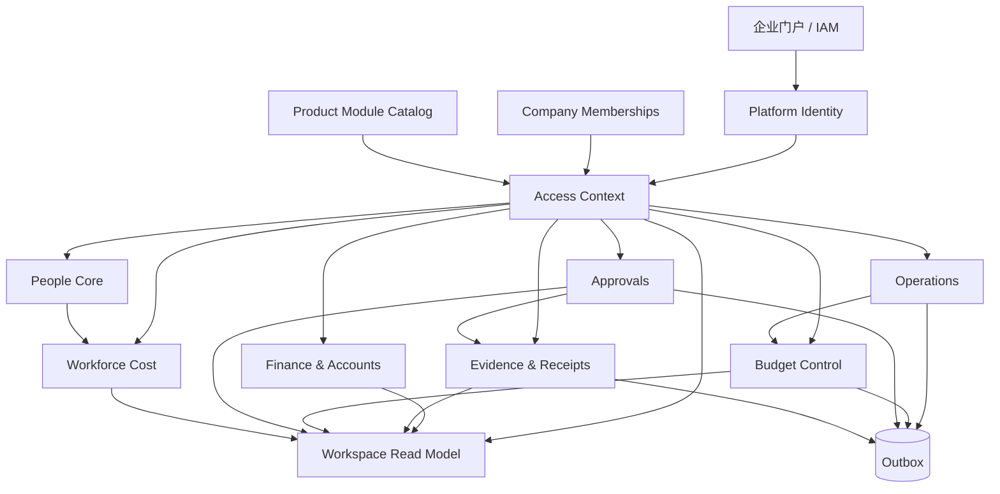

# Mamoji 企业内部模块架构

> 本文是代码拆分与依赖治理规范。目标是模块化单体，而不是立即拆成微服务；先获得清晰边界、稳定契约和独立测试，再根据真实吞吐与团队边界决定是否物理拆分。

## 1. 架构原则

1. 按业务能力拆分，不按 Controller、Service、Repository 技术层横向堆放。
2. 公司边界、人员身份、数据范围和产品模块必须在进入业务用例前确定。
3. 写模型归所属模块，跨模块只通过应用服务、只读投影或领域事件协作。
4. 聚合首页使用专门读模型，不让前端承担跨模块编排。
5. PostgreSQL 是在线事实来源；进程内集合不得参与在线授权或业务判断。
6. 外部副作用经 Outbox 传播，数据库事务内不直接依赖消息系统或 Webhook。
7. 模块开关是后端能力边界，不只是导航配置。

## 2. 目标模块图



依赖方向是从业务用例指向平台契约或所属仓储。`workspace` 可以读取多个模块的投影，但不能反向成为它们的写入口。

## 3. 模块能力拆分

| 边界 | 命令职责 | 查询职责 | 主要数据 | 对外契约 |
| --- | --- | --- | --- | --- |
| `platform.identity` | 解析当前人员 | 当前 Actor | 用户会话/外部身份声明 | `ActorContext`、`@CurrentActor` |
| `platform.tenant` | 同步成员关系 | 公司、角色、部门、范围 | `company_memberships` | `CompanyMembershipRepository` |
| `platform.access` | 权限校验 | 完整访问上下文 | 角色权限矩阵 | `/platform/access-context` |
| `platform.product` | 模块启停 | 已启用能力 | 环境配置 | `ProductModuleCatalog`、`@RequiresProductModule` |
| `workspace` | 无业务写入 | 跨模块健康度、待办、指标 | SQL 投影 | `GET /workspace` |
| `approvals` | 提交、通过、驳回、撤回 | 我的申请/待办/轨迹 | `approval_requests/actions` | `/approvals`、Outbox |
| `operations` | 流水、分类、周期事项 | 趋势、结构、经营风险 | `transactions/categories/recurring_items` | `/transactions`、`/stats` |
| `budget` | 创建、调整、停用预算 | 执行额、使用率、风险 | `budgets` + 流水投影 | `/budgets`、Outbox |
| `finance` | 账户维护、余额调整、对账 | 可用资金、账户风险 | `accounts/ledgers` | `/accounts`、`/ledgers` |
| `evidence` | 票据、附件、审批/入账状态 | 凭证缺口、审计链 | `receipt_vouchers`、对象存储 | `/receipts`、Outbox |
| `people-core` | 部门、员工与任职信息维护 | 组织、人员状态与经营投影 | `departments/employees/employment_events` | `/enterprise/departments`、`/enterprise/employees` |
| `workforce-cost` | 薪酬批次生成、锁定 | 公司/部门人力成本、预算差异、趋势 | `payroll_runs/items` + 人员/流水只读投影 | `/payroll-runs`、`GET /workforce-cost` |
| `notifications` | 偏好与发送状态 | 站内通知 | `notifications/deliveries` | `/notifications` |

`people-core` 与 `workforce-cost` 是默认经营能力，`talent-suite`（福利、绩效）、税务、政策和备份 UI 是可选能力包。任何可选能力都不允许成为核心模块的反向依赖。

## 4. 统一访问上下文

所有新模块使用下面的入口模型：

```text
ActorContext
  -> AccessContextService
      -> enabled company
      -> membership role/scope/department
      -> permissions
      -> enabled product modules
```

前端通过一次请求获得：

```json
{
  "actor": {},
  "company": {},
  "companies": [],
  "role": "finance_admin",
  "scope": "company",
  "departmentId": null,
  "permissions": ["finance.read", "budget.manage"],
  "modules": { "mode": "internal-module", "enabled": ["workspace", "budgets"] }
}
```

规则：

- Controller 不自行解析用户 ID 或相信客户端提交的操作者字段。
- companyId 必须由访问上下文校验，不能只作为普通过滤参数。
- `department` 和 `self` 范围必须进入 SQL 谓词；仅在 Java 返回后过滤会扩大数据暴露和读取成本。
- `readonly` 表示公司级只读，是否可执行命令仍由 permission 判断。
- 可选模块 API 使用 `@RequiresProductModule`，关闭时统一返回 404。

## 5. 模块内部结构

新拆出的业务模块采用纵向目录：

```text
com.mamoji.<module>/
  api/             HTTP DTO、Controller、序列化契约
  application/     用例编排、事务边界、权限入口
  domain/          业务规则、值对象、状态机
  infrastructure/  JDBC 仓储、外部系统适配器
```

预算模块是当前模板：

```text
budget/
  api/BudgetController
  api/BudgetCreateRequest
  api/BudgetUpdateRequest
  application/BudgetApplicationService
  domain/BudgetPolicy
  infrastructure/BudgetRepository
```

拆分下一个模块时，应复制结构原则，而不是复制具体实现。

人力成本读模型也采用同一纵向结构：

```text
workforce/
  api/WorkforceCostController
  api/WorkforceCostView
  application/WorkforceCostApplicationService
  infrastructure/WorkforceCostReadRepository
```

该模块不复制员工或薪酬写模型：正式口径读取 `payroll_run_items` 快照；未生成批次时读取员工成本估算，并在响应中返回明确的 `source`。

## 6. API 与命令约束

### 6.1 DTO

- 新写接口不得以 `Map<String, Object>` 作为长期契约。
- 请求 DTO 使用 Bean Validation；金额、日期、状态和长度在 API 边界校验。
- 响应 DTO 不直接泄露密码散列、内部存储密钥或无授权的公司字段。
- 部分更新必须区分“未提交字段”和“明确清空字段”。预算用 `clearCategory` 展示了该语义。

### 6.2 重试与并发

- 关键创建请求接受 `Idempotency-Key`，数据库使用唯一索引保证最终防重。
- 账户、交易、预算、票据和审批使用版本字段或行锁保护并发写入。
- 客户端编辑预算时提交读取到的 `version`；过期版本返回 409。
- 冲突、参数错误和约束错误由统一 `ProblemDetail` 响应处理。

### 6.3 可观测性

- 每个请求接收或生成 `X-Request-Id`，响应回传并写入 MDC。
- 审计日志记录人员、公司、对象、动作和摘要。
- 模块事件先写 `outbox_events`，事务提交后再发送通知或外部消息。

## 7. 工作台读模型

工作台只做查询聚合，当前在一个 `REPEATABLE_READ` 只读事务中计算：

- 本月收入、成本和经营净额；
- 可用资金与账户问题；
- 预算执行和高风险预算；
- 待审批数量；
- 票据证据缺口；
- 逾期周期事项；
- 模块健康度、优先动作和日清检查。

工作台遵循权限裁剪：无财务读取权限时，资金与票据指标返回空值或不生成模块；部门/本人范围只聚合允许的人员数据。

前端不得重新并发请求这些下游接口来重算同一组指标，否则会产生快照不一致和重复规则。

## 8. 数据所有权

| 表或投影 | 所属模块 | 其他模块如何使用 |
| --- | --- | --- |
| `company_memberships` | Platform Tenant | 只通过成员仓储读取 |
| `transactions`、`categories` | Operations | Budget/Workspace 使用只读 SQL 投影 |
| `budgets` | Budget | Operations 只请求匹配预算；Workspace 只读 |
| `accounts`、`ledgers` | Finance | Operations 通过账户 ID 校验与调整 |
| `receipt_vouchers` | Evidence | Approval 通过应用服务更新审批状态 |
| `departments`、`employees`、`employment_events` | People Core | Workforce Cost 仅通过有范围约束的 SQL 投影读取 |
| `payroll_runs`、`payroll_run_items` | Workforce Cost | 报表与工作台只读已锁定或明确标识状态的快照 |
| `approval_requests/actions` | Approvals | Workspace 只读待办数量 |
| `audit_logs` | Platform Audit | 业务模块只追加，不修改历史 |
| `outbox_events` | Platform Events | 消费器按事件类型分发 |

禁止通过另一个模块的公开 Map 修改对象。跨模块写入必须调用应用服务；高频聚合允许直接读取稳定投影，但不能借此写回所属表。

## 9. 数据库与部署基础

V8 迁移建立了：

- 权威 `company_memberships` 表及公司、用户、部门外键；
- 关键表 `version` 字段；
- 交易、票据和审批的幂等键及唯一索引；
- 金额、日期、状态和公司 ID 的基础约束；
- 常用成员查询索引。

在线服务读取已经从进程 Map 切到 PostgreSQL。两套旧 Store 的集合目前只承担演示初始化、兼容恢复和过渡同步。

当前生产配置仍默认开启 `MAMOJI_SINGLE_INSTANCE_GUARD_ENABLED=true`。解除该保护前必须完成：

1. 把 `@PostConstruct` 中的演示/兼容修复迁移成一次性 migration 或独立 bootstrap job；
2. 删除 Store 中剩余兼容 Map 与 reload 钩子；
3. 在真实 PostgreSQL 上通过双实例并发写、重复命令和故障重试测试；
4. 确认定时任务使用抢占锁或 `SKIP LOCKED`，不会被每个实例重复执行。

## 10. 后续拆分顺序

### P0：完成核心边界

- 将审批、票据和账户从旧横向 Service 目录迁入纵向模块目录。
- 给交易、账户、票据补齐 typed DTO 与客户端版本契约。
- 将权限判断从旧整数角色进一步收口到 AccessContext。
- 将组织人员和薪酬写用例逐步迁入 `people`、`workforce` 纵向目录；现有聚合读模型保持稳定契约。

### P1：清除兼容状态

- 把演示数据改成显式 profile 或开发脚本，不在生产启动路径执行。
- 删除 `InMemoryStore`、`EnterpriseStore` 的公开集合。
- 将金额和日期从 TEXT 逐步迁为 `NUMERIC`、`DATE/TIMESTAMPTZ`。

### P2：集成宿主平台

- 增加 OIDC/SAML 身份适配器和 JIT 成员映射。
- 定义公司、部门和人员主数据同步契约。
- 把通知目标接到企业消息总线，保留站内通知降级路径。

### P3：按证据决定物理拆分

只有当独立发布节奏、资源隔离、合规边界或吞吐瓶颈真实存在时，才把某一模块拆成服务。拆分前要求其 API、事件、表所有权和回归测试已经稳定。

## 11. 合并检查清单

新功能合并前至少确认：

- [ ] 归属一个明确模块，没有新增跨模块 Map 访问；
- [ ] Actor、companyId、scope 和 permission 都经过统一校验；
- [ ] 可选能力同时有前端和后端模块门禁；
- [ ] 写请求有 DTO 校验，重试场景考虑幂等性；
- [ ] 并发更新使用版本或行锁；
- [ ] 跨模块副作用有审计和 Outbox；
- [ ] 查询避免 N+1，并有分页或有界 limit；
- [ ] 单元测试、类型检查、Lint 与可用的 PostgreSQL 集成测试通过。
